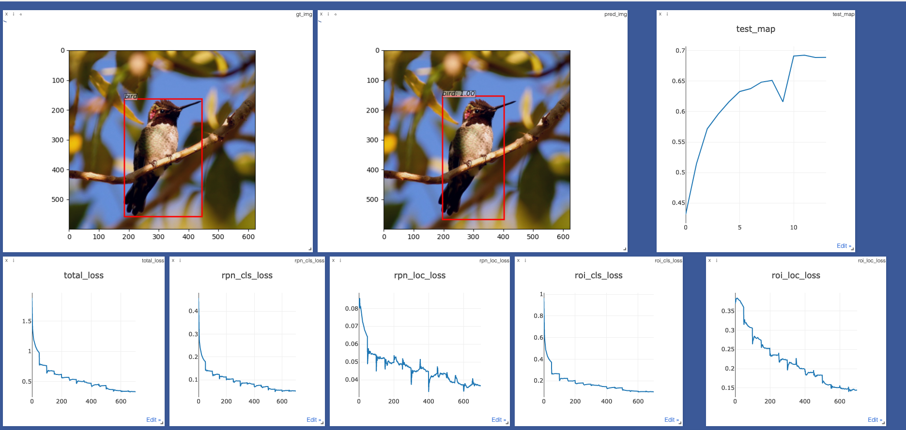

# Implemtation of Faster R-CNN
A straightforward implementation of Faster R-CNN

# Steps
### 0. Experiment environment set up. 
Google Cloud is a good choice. For set up detail, please refer: https://github.com/cs231n/gcloud

### 1. Install dependencies
NOTE: I use `anaconda` in the experiement. It's easier to manage the package version in different environments. 
Here is an example to create environment
```
# create new environment 
conda create --name fcnn python=3.7
conda activate fcnn
# install pythorch and other dependancy
conda install pytorch torchvision cudatoolkit=10.2 -c pytorch
pip install visdom scikit-image tqdm fire ipdb pprint matplotlib torchnet

# start visdom and run in background
nohup python -m visdom.server &
```

NOTE: if you don't use anaconda, you need to install the Pytorch(with GPU). In addition, with the above google cloud set up, sometimes the default cudatoolkit is outdated. So we need to download the latest cuda driver. Here is a link: https://drive.google.com/file/d/1THcuKRYdpcD9Zyl7HYvAwApx7Fhl93Dx/view?usp=sharing


### 2 Train

#### 2.1 Data preparation
Let's use VOC2007 as example. 
1. Download the training, validation, test data and VOCdevkit. 
```Bash
wget http://pjreddie.com/media/files/VOCtrainval_06-Nov-2007.tar
wget http://pjreddie.com/media/files/VOCtest_06-Nov-2007.tar
wget http://pjreddie.com/media/files/VOCdevkit_08-Jun-2007.tar
```
VOC mirror: https://pjreddie.com/projects/pascal-voc-dataset-mirror/

2. Extract all data into VOCdevkit. 
```Bash
tar xvf VOCtrainval_06-Nov-2007.tar
tar xvf VOCtest_06-Nov-2007.tar
tar xvf VOCdevkit_08-Jun-2007.tar
```
The structure should be: 
```
└── VOCdevkit
    ├── local
    │   ├── VOC2006
    │   └── VOC2007
    ├── results
    │   ├── VOC2006
    │   │   └── Main
    │   └── VOC2007
    │       ├── Layout
    │       ├── Main
    │       └── Segmentation
    ├── VOC2007
    │   ├── Annotations
    │   ├── ImageSets
    │   │   ├── Layout
    │   │   ├── Main
    │   │   └── Segmentation
    │   ├── JPEGImages
    │   ├── SegmentationClass
    │   └── SegmentationObject
    └── VOCcode
```
#### 2.2 Update data path
update `voc_data_dir` in `tuils/config.py` or pass the data path as param like `--voc-data-dir=/path/to/VOCdevkit/VOC2007/`
#### 2.3 Train
```bash
python train.py train --env='faster-rcnn' --plot-every=100
```
please refer `utils/config.py` for the argument. 

To check the training status and loss in visdom, visit `http://<ip>:8097` and check the visualization.


